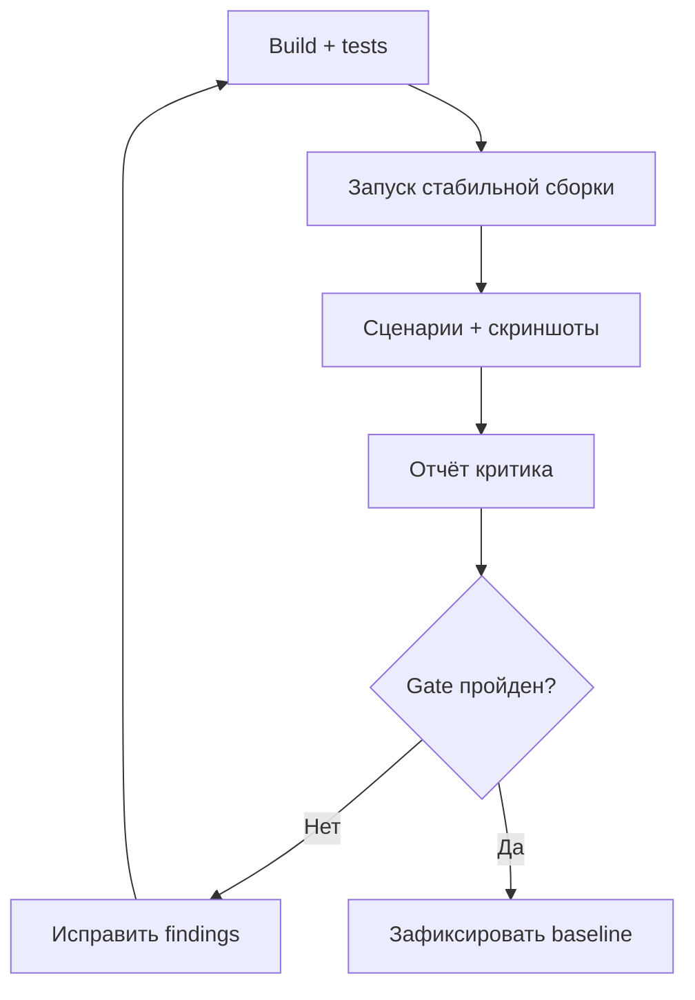

# Design Quality Gate — цикл критика

## Назначение

Не допустить ситуацию, когда функции формально существуют, но интерфейс выглядит как незавершённый прототип, расходится между страницами или ломается на мобильном устройстве.

Критик оценивает только реально запущенную production-like сборку. Код, Storybook и исходный референс сами по себе не являются доказательством качества.

## Роли цикла

### Builder

Реализует функцию, запускает проверки, исправляет подтверждённые замечания и не изменяет критерии приёмки ради прохождения gate.

### Critic

Открывает работающий продукт как игрок и администратор, проходит сценарии, делает новые скриншоты, проверяет поведение, оформляет findings с доказательствами. Критик не ставит оценку по памяти и не принимает собственные заявления Builder без проверки.

Рекомендуемый режим — новый контекст Codex для критика. Если используется один контекст, перед каждым раундом он обязан заново открыть приложение и получить новые evidence.

## Цикл



## Обязательные поверхности

| Surface | Desktop | Mobile | Основные состояния |
| --- | --- | --- | --- |
| Login/registration | 1440 | 390 | default, validation, error, loading |
| Player lobby | 1440, 1024 | 768, 390 | populated, loading, empty, unavailable |
| Game preview/demo | 1440 | 390 | open, insufficient TSC, result/refund |
| Profile/wallet history | 1440 | 390 | populated, empty, pagination |
| Bonus center | 1440 | 390 | offer, active, expired, ineligible |
| Daily rewards/promo | 1440 | 390 | claimable, claimed, invalid code |
| Responsible gaming | 1440 | 390 | limits, cooling-off, confirmation |
| Admin dashboard | 1440, 1024 | 768 minimum | normal, loading, error |
| Player 360 | 1440 | 768 minimum | masked PII, ledger timeline |
| Test Funds Grant | 1440 | 768 minimum | form, validation, preview, success, forbidden |
| Bonus campaign admin | 1440 | 768 minimum | draft, review, published, paused |
| Audit/risk/support | 1440 | 768 minimum | filters, empty, detail |

Критик проверяет только surfaces, уже входящие в текущий мастер-промт. Итоговый раунд после Prompt 03 проверяет всю таблицу.

## Evidence protocol

Для каждого шага:

1. Запустить production build или максимально близкий staging profile с seed fixtures.
2. Дождаться визуально стабильного состояния без spinner/layout shift.
3. Получить свежий DOM/accessibility snapshot, если инструмент поддерживает.
4. Сделать screenshot и сохранить как `artifacts/design-audit/round-N/NN-surface-state-width.png`.
5. Открыть сохранённый screenshot и убедиться, что он не пустой, не обрезан и показывает нужное состояние.
6. Привязать каждое замечание к screenshot, route, viewport и шагу.
7. Не утверждать полную доступность по скриншоту: keyboard, focus, semantics и screen-reader name проверяются отдельно.

## Линзы критика

- достижение пользовательской цели;
- информационная архитектура и понятность следующего действия;
- визуальная иерархия;
- соответствие Midnight Emerald tokens;
- единообразие компонентов и текстов;
- responsive reflow и отсутствие overflow;
- keyboard/focus/labels/errors/target size/contrast;
- loading/empty/error/disabled/success states;
- доверие: DEMO/TSC маркировка, понятность денег, отсутствие misleading UI;
- реальные функции: кнопки, формы, фильтры, навигация и permissions работают;
- отсутствие копирования бренда и ассетов референса.

## Severity

- `P0 Blocker`: потеря/искажение данных, обход permissions, возможность спутать TSC с BTC, критический сценарий не работает.
- `P1 High`: ключевой flow нельзя завершить, broken responsive layout, недоступная основная функция, серьёзное расхождение дизайна.
- `P2 Medium`: заметная UX/visual/accessibility проблема с обходным путём.
- `P3 Polish`: косметическая или малозначимая последовательность.

## Scorecard — 100 баллов

| Раздел | Вес |
| --- | ---: |
| Функциональная целостность сценариев | 25 |
| Визуальная иерархия и соответствие дизайн-системе | 20 |
| Responsive и состояния | 15 |
| Доступность | 15 |
| Консистентность компонентов/копирайта | 10 |
| Доверие, DEMO и финансовая ясность | 10 |
| Производительность/визуальная стабильность | 5 |

Оценка подтверждается ссылками на evidence и тестами. Нельзя начислять баллы за непроверенную поверхность.

## Условия PASS

- score ≥92/100;
- `P0=0`, `P1=0`;
- `P2=0` в auth, admin permissions, ledger, test funds и responsible gaming;
- все обязательные surfaces текущего этапа имеют свежие принятые screenshots;
- critical user flows проходят e2e;
- axe/эквивалент не показывает serious/critical violations на проверенных страницах;
- keyboard-only проверка основных flows завершена;
- 1440/1024/768/390 не имеют page-level horizontal overflow;
- design tokens не обходятся массовыми hardcoded values;
- visual-regression baseline обновлён только после PASS.

## Ограничение цикла

Максимум 5 раундов в одном запуске. После каждого раунда число P0/P1/P2 должно уменьшаться или отчёт объясняет объективную причину. Если два раунда подряд нет прогресса, нельзя продолжать косметическую перестройку: записать blocker, root cause и точное решение, затем остановиться. P3 не блокирует релиз, если score достигнут и P3 занесены в backlog.

## Формат finding

```yaml
id: DQ-002-04
round: 2
severity: P1
surface: Test Funds Grant
route: /admin/players/:id/test-funds
viewport: 768x1024
evidence: artifacts/design-audit/round-2/07-test-funds-preview-768.png
problem: Preview перекрывает кнопку подтверждения.
impact: Финансовый администратор не может завершить выдачу на tablet.
expected: CTA остаётся видимым и доступным с клавиатуры.
recommendation: Перевести footer формы в sticky area внутри dialog и проверить safe spacing.
verification: Playwright flow + screenshot + keyboard Tab/Enter.
status: open
```

## Артефакты каждого раунда

- `artifacts/design-audit/round-N/` — screenshots;
- `docs/quality/DESIGN-AUDIT-ROUND-N.md` — краткий отчёт;
- `docs/quality/design-findings.json` — машиночитаемый список;
- `docs/quality/DESIGN-SCORECARD.md` — история оценок;
- Playwright/axe/visual regression reports;
- список исправлений и проверок в `docs/PROJECT_STATE.md`.

Не коммитить тяжёлые временные traces/videos без необходимости. Принятые baseline screenshots и компактные отчёты можно хранить по политике репозитория.
