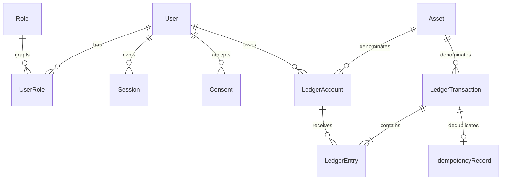

# Foundation ERD

```mermaid
erDiagram
 User ||--o{ UserRole : has
 Role ||--o{ UserRole : grants
 User ||--o{ Session : owns
 User ||--o{ Consent : accepts
 User ||--o{ LedgerAccount : owns
 Asset ||--o{ LedgerAccount : denominates
 Asset ||--o{ LedgerTransaction : denominates
 LedgerTransaction ||--|{ LedgerEntry : contains
 LedgerAccount ||--o{ LedgerEntry : receives
 LedgerTransaction ||--o| IdempotencyRecord : deduplicates
```

AuditEvent and FeatureFlag intentionally have no cascading ownership. Ledger and audit records have no delete lifecycle.
