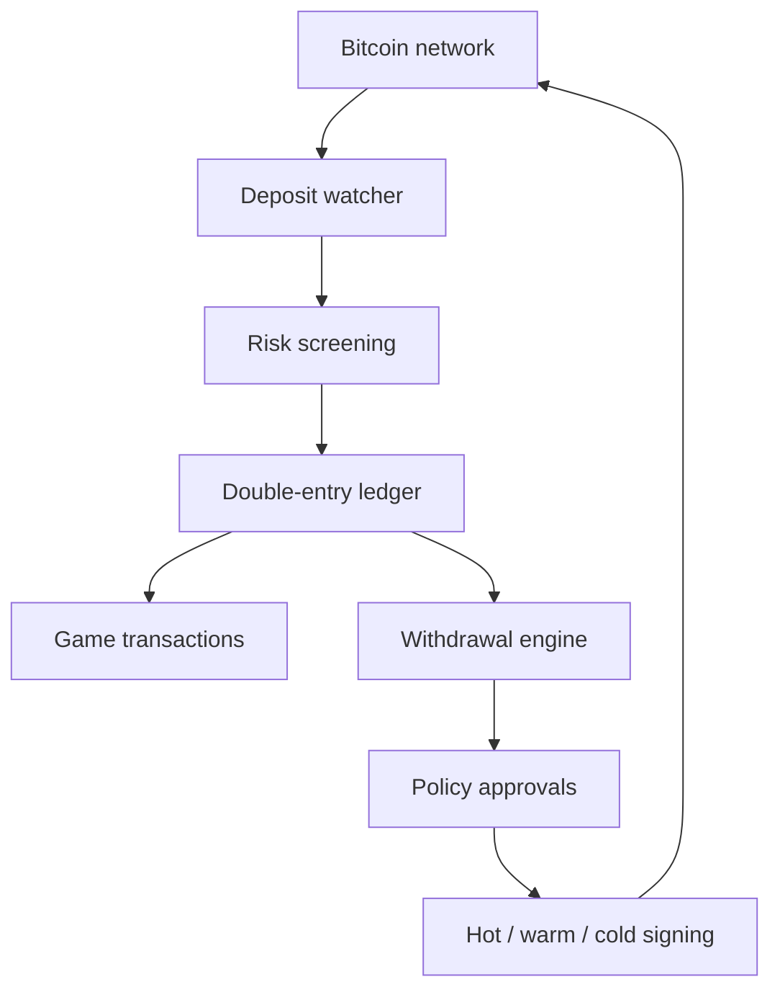

# 02. Bitcoin-кошелёк и финансовый ledger

## 1. Архитектурный принцип

Blockchain не является базой пользовательских балансов. Источник истины по обязательствам перед игроками — внутренний ledger, сверяемый с контролируемыми UTXO.

## 2. Wallet tiers

- `WAL-001`: отдельные окружения и ключи dev/test/prod.
- `WAL-002`: уникальный deposit address на пользователя/назначение; повторное использование минимизировать.
- `WAL-003`: watch-only компонент не имеет signing keys.
- `WAL-004`: hot wallet держит только операционный лимит.
- `WAL-005`: warm/cold storage использует multisig/MPC/HSM и разделённые полномочия.
- `WAL-006`: seed/private key никогда не попадает в app DB, logs, CI или support tools.
- `WAL-007`: документированные ceremony, backup, restore drill, key rotation и succession.
- `WAL-008`: treasury rebalance выполняется по policy с dual control.

## 3. Депозиты

- `DEP-001`: система назначает адрес и отслеживает UTXO, а не только txid.
- `DEP-002`: состояние: detected → screening → confirming → credited/held/rejected.
- `DEP-003`: количество подтверждений конфигурируется по сумме и риску; 0-conf не кредитуется по умолчанию.
- `DEP-004`: reorg/RBF/malleability сценарии обработаны и протестированы.
- `DEP-005`: депозит ниже dust/minimum маркируется по прозрачной политике.
- `DEP-006`: credited создаёт сбалансированную проводку и audit event ровно один раз.
- `DEP-007`: адрес/кластер проходит blockchain screening; high-risk deposit уходит в case management.
- `DEP-008`: sweep не меняет пользовательский баланс.
- `DEP-009`: неизвестные/ошибочные сети и активы не обещаются к автоматическому возврату.

## 4. Выводы

- `WDR-001`: eligibility: KYC, geo, sanctions, limits, wagering, available cash, account status.
- `WDR-002`: вывод резервирует средства проводкой до отправки.
- `WDR-003`: risk score учитывает account/device/IP/address/velocity/source of funds.
- `WDR-004`: новые адреса и security changes активируют cooldown по policy.
- `WDR-005`: комиссии и итоговая сумма видны до подтверждения.
- `WDR-006`: уровни straight-through, manual review, enhanced due diligence, reject.
- `WDR-007`: batch withdrawals допустимы; связь user withdrawal ↔ output сохраняется.
- `WDR-008`: signing policy включает лимиты суммы/дня/адреса и quorum.
- `WDR-009`: broadcast, confirmation, replacement и failure обрабатываются state machine.
- `WDR-010`: отмена возможна только до необратимой стадии и оставляет audit trail.
- `WDR-011`: support не может менять адрес или одобрять вывод.

## 5. Double-entry ledger

Основные счета:

- assets: on-chain hot/warm/cold, receivables, fee reserve;
- liabilities: player cash available, cash reserved, bonus available, bonus locked, pending withdrawals;
- revenue/expense: gaming revenue, bonus expense, network fee expense, adjustments;
- clearing: provider/game settlement и reconciliation suspense.

Инварианты:

- `LED-001`: сумма debit = сумма credit для каждой транзакции.
- `LED-002`: immutable entries; delete/update запрещены.
- `LED-003`: balance — производная проводок или проверяемая materialized projection.
- `LED-004`: отрицательный available balance запрещён constraint/serializable control.
- `LED-005`: уникальный external reference предотвращает повтор callbacks/webhooks.
- `LED-006`: cash и bonus никогда не смешиваются неявно.
- `LED-007`: reserve/commit/release — атомарные операции.
- `LED-008`: ручная корректировка только reason code + evidence + maker-checker.
- `LED-009`: каждая проводка содержит actor, source, correlation ID, jurisdiction, timestamp.
- `LED-010`: ежедневная проверка ledger balance и reconciliation.

## 6. Игровые проводки

- ставка: player cash/bonus available → game clearing/reserved;
- выигрыш: game clearing → player cash/bonus по правилам источника;
- refund/rollback: отдельная компенсирующая проводка;
- последовательность provider events может быть out-of-order;
- round закрывается только после согласованного state transition;
- повторный callback возвращает прежний результат без второй проводки.

## 7. Резервы и solvency

- on-chain контролируемые активы регулярно сопоставляются с liabilities;
- alert при расхождении или снижении coverage ratio;
- segregated player funds — если требует лицензия;
- proof-of-reserves не заменяет аудит liabilities;
- treasury dashboard показывает UTXO, exposure, fee forecast и runway без раскрытия ключей.

## 8. Сверка

Ежедневно и near-real-time:

1. Bitcoin node/provider ↔ wallet service.
2. Wallet service ↔ ledger.
3. Ledger ↔ game provider callbacks/reports.
4. Ledger ↔ withdrawals/broadcast outputs.
5. Ledger ↔ BI/finance reports.

Расхождения попадают в suspense queue, получают owner, severity, SLA и доказательство закрытия.
